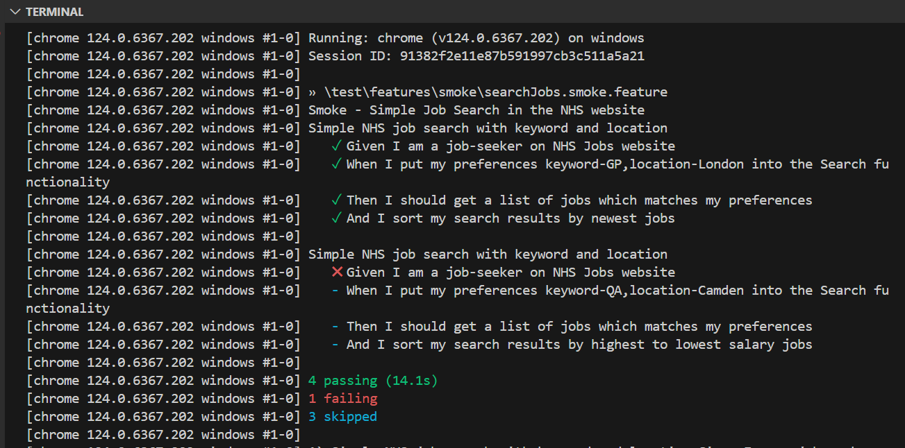
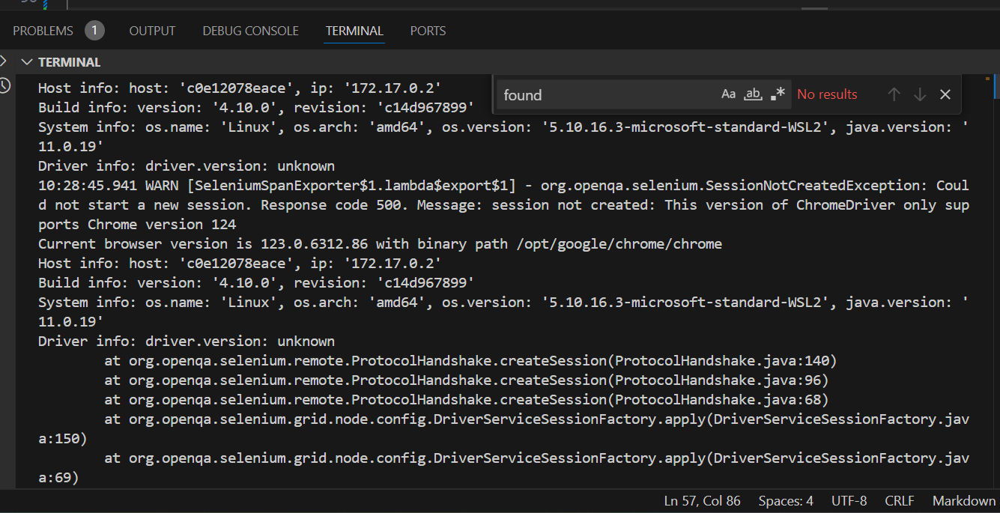
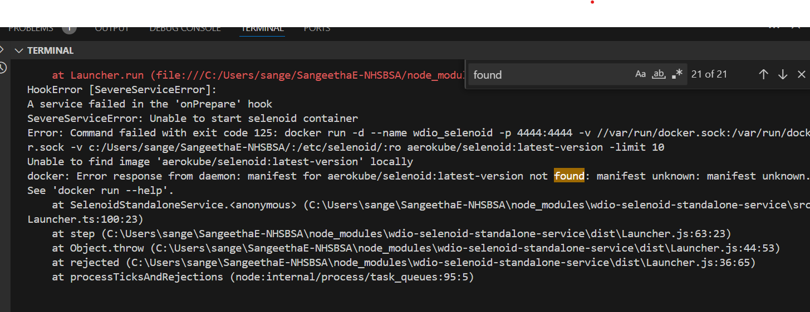

# Description: 
This framework aims to test functionality , accessibilty and compatibility of https://www.jobs.nhs.uk/candidate/search using webdriverio , javascript and cucumber BDD

# Pre-requisites:
Download and install  
- node.js  v20.13.1  https://nodejs.org/en/download/
- npm version- v10.5.2 ( will be installed along with node )
- IDE of choice (VScode- https://code.visualstudio.com/download) 

# Usage:
From the command line terminal 
- git clone https://github.com/SangeethaEaswaran/SangeethaE-NHSBSA.git 
- cd SangeethaE-NHSBSA
- npm install 
- run tests using below CLI commands 
    - npm run smoke 
    - npm run regression
    - npm run accessibility

# Reporting used :
Test results are viewed on console 
1. Spec reporter : 

# Packages used 
- @axe-core/webdriverio: open-source accessibility tool to test accessibility within webdriverio test suite
- @babel/core: Babel core is a JavaScript compiler
- @babel/preset-env: is a smart preset that allows to use the latest JavaScript are needed by your target environment(s)
- @babel/register:The require hook will bind itself to node's require and automatically compile files
- wdio/allure-reporter: A WebdriverIO reporter plugin to create Allure Test Reports.
- @wdio/cli: test runner to help you start testing as quickly as possible
- @wdio/cucumber-framework: A WebdriverIO plugin. Adapter for CucumberJS v5 testing framework.
- @wdio/junit-reporter:A WebdriverIO reporter that creates Jenkins compatible XML based JUnit reports
- @wdio/local-runner: A WebdriverIO runner to run tests locally within worker processes
- chromedriver: An NPM wrapper for Selenium ChromeDriver.
- deepmerge: A library for deep (recursive) merging of Javascript objects
- fs:
- fs-extra: adds file system methods that aren't included in the native fs module 
- prettier: code formatter that enforces a consistent style by parsing your code
- wdio-chromedriver-service:helps you to run ChromeDriver seamlessly when running tests with the WDIO testrunner.
- @wdio/spec-reporter:A WebdriverIO plugin to report in spec style.
- wdio-html-nice-reporter: 
- wdio-video-reporter: 
- wdio-html-reporter: 
- multiple-cucumber-html-reporter:
-@wdio/selenium-standalone-service

# Exercise requirements 
- Feature files are structured using Gherkin BDD syntax aiming to be easily clear and understandable for non-technical team members 
- Reusable step definitions are implemented using parameterisation to promote code reusability and reduce duplication
- Feature file -> step definitions -> page objects -> page elements model implemented
- Automated scenarios that provide most value and focus on critical functions adhering to test principles 

Below exercise is incomplete:
- Test should run in the framework doesnt need a downloaded or machine based driver  
    
    - Tried to https://www.npmjs.com/package/selenium-standalone , but faced error - use as a Docker Service but required more time complete it , note need to run - docker run -it -p 4444:4444 webdriverio/selenium-standalone

    - Tried to test using selenium-standalone service https://www.npmjs.com/package/wdio-selenoid-standalone-service - but faced this error  and required more time to troubleshoot

# yet to implement 
parallel execution 
